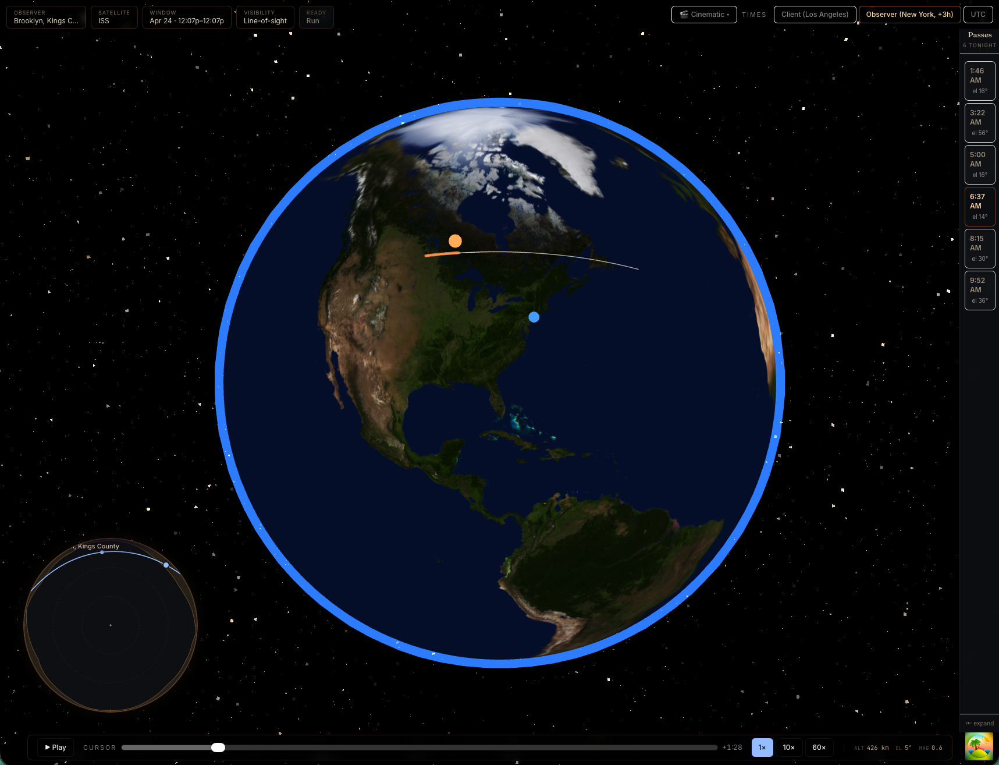
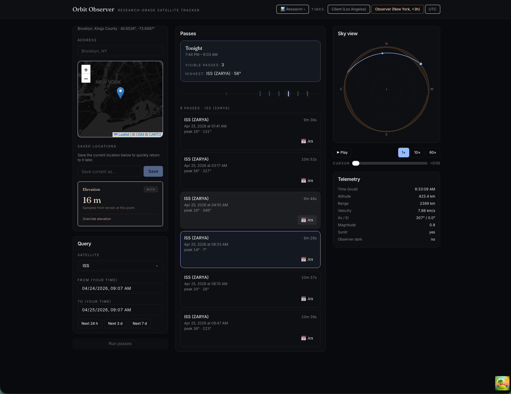

# Satellite Visibility

Local, research-grade satellite pass prediction with a cinematic-ish frontend.
Runs entirely on your machine: skyfield + FastAPI backend, React + Three.js
frontend, zero cloud dependencies beyond free data sources (Celestrak TLEs,
OpenTopography DEM tiles, OSM map tiles).

**Version:** v0.7.0 — Observatory aesthetic (Fraunces / Inter / JetBrains
Mono typography, amber-gold accent), procedural Milky Way starfield,
refined atmosphere, redesigned observer-elevation field, and a top-left
row of config chips (Observer · Satellite · Window · Visibility · Run)
replacing the cinematic-mode left drawer.





---

## What this does

Pick an observer location (map pin or address), pick a satellite (ISS,
Hubble, Starlink group, NORAD ID, or fuzzy-search anything), pick a time
range, and get:

- **A pass list** with rise/peak/set times, peak elevation, and magnitude.
- **A timeline strip** showing every pass in the window at a glance.
- **A sky view** — alt-azimuth dome with terrain silhouette, predicted pass
  arc, and a playback cursor you can scrub through the arc.
- **A 3D earth view** — full-viewport globe in cinematic mode (with
  ground-track line, drag-to-rotate camera, pass-selection reframe) or
  as a side panel in research mode. Automatic observer-elevation lookup
  so mountain locations (Mauna Kea, Everest) compute passes correctly.
- **Live telemetry** — altitude, range, velocity, az/el, magnitude, sunlit,
  observer-dark — bound to the playback cursor at 1×, 10×, or 60× speed.
- **ICS calendar export** per pass.
- **A tonight summary card** highlighting the brightest and highest passes
  between local sunset and next sunrise.
- **Timezone awareness** — toggle between client / observer / UTC display
  with a warning if the two timezones differ.

The engine (`core/`) uses `skyfield` for SGP4 propagation and is accurate to
±1 s / ±0.1° against Heavens-Above (see [`docs/accuracy-log.md`](docs/accuracy-log.md)).

## Quick start

```bash
# backend
uv venv
source .venv/bin/activate
uv pip install -e ".[dev]"

# frontend
just web-install
```

Set your free OpenTopography API key (needed for terrain horizon masks):

```bash
cp .env.example .env
# edit .env to add SATVIS_OPENTOPOGRAPHY_API_KEY=<your-key>
# get a key at https://portal.opentopography.org/
```

Then in two shells:

```bash
just serve   # shell 1: API on http://127.0.0.1:8765
just web     # shell 2: frontend on http://localhost:5173
```

Open `http://localhost:5173/`.

## Your first pass

1. The observer defaults to Brooklyn, NY. Click on the map to move the pin,
   or type an address in the search box.
2. The satellite defaults to ISS. Click the **SATELLITE** chip (cinematic)
   or the satellite dropdown (research) to search for others
   (`hubble`, `starlink`, `25544`, etc.).
3. Pick a time window — the presets (`Next 24 h`, `Next 3 d`, `Next 7 d`)
   are fastest.
4. Choose **Line-of-sight** for radio/tracking (any pass above the horizon)
   or **Naked-eye** for visible passes only (sunlit + observer in darkness).
5. Click any pass in the list. The sky view and 3D earth render the selected
   pass's arc. Hit ▶ Play to scrub through it in real time.

## Concepts

### Observer vs client

The **observer** is the geographic point you picked (lat/lng). The **client**
is you — the browser/machine running the app. They may or may not share a
timezone. The header's timezone toggle (`Client | Observer | UTC`) controls
how all times display; there's a warning banner in the observer panel when
the two timezones differ.

### Visibility modes

- **Line-of-sight:** any pass with elevation above the horizon (accounting
  for terrain). Useful for radio operators and anyone who doesn't care about
  sunlight.
- **Naked-eye:** passes where the satellite is sunlit AND the observer is in
  darkness. The only ones you can actually see with your eyes.

### Group queries

Querying a group like `starlink` or `stations` would return hundreds of
passes at once. By default `/passes` filters a group to "notable passes only"
(peak elevation ≥ 30°, magnitude ≤ +4 in naked-eye mode). Individual
satellite queries are never auto-filtered.

## Accuracy

The golden test (`tests/golden/test_iss_nyc.py`) locks the engine's output
against a frozen baseline to ±1 s / ±0.1°. Results are recorded quarterly
in [`docs/accuracy-log.md`](docs/accuracy-log.md) against Heavens-Above.

To run a fresh cross-check:

```bash
just verify --markdown   # emits markdown table rows for the accuracy log
```

Open the printed Heavens-Above URL, compare passes, paste the rows into the
log with the observed deltas filled in.

## Commands

| Command | What it does |
|---|---|
| `just test` | Python test suite |
| `just web-test` | Frontend test suite (vitest) |
| `just lint` / `just web-lint` | Ruff / ESLint |
| `just cov` / `just web-cov` | Coverage reports |
| `just serve` | Start the API |
| `just web` | Start the Vite dev server |
| `just web-build` | Production frontend build |
| `just demo` | Python CLI demo (ISS over NYC by default) |
| `just verify` | Accuracy verification helper |

## Project layout

```
core/                Pure Python engine (zero web deps)
  orbital/           SGP4 pass prediction + trajectory sampling
  visibility/        Darkness / sunlit / magnitude / filtering
  catalog/           TLE parsing + fuzzy satellite search + Celestrak client
  terrain/           OpenTopography DEM fetch + horizon mask compute
  trains/            Starlink train clustering heuristic
api/                 FastAPI app wrapping core/
  routes/            /passes, /sky-track, /horizon, /tle-freshness,
                     /catalog/search, /geo/timezone
  schemas/           Pydantic request + response models
web/                 React + Vite frontend
  src/
    components/      UI (layout, observer, satellite, passes, sky-view,
                     earth-view, hero, playback, telemetry, ui primitives)
    hooks/           TanStack Query wrappers + composed hooks
    store/           Zustand stores (observer, satellite, time-range,
                     selection, playback, display-tz)
    lib/             Pure helpers (api, interpolation, ics, geo3d, sun,
                     format-time)
tests/               Python: unit + golden + integration + api_unit
scripts/             demo.py, verify_accuracy.py, serve.sh
docs/
  superpowers/
    specs/           The design spec this project was built from
  accuracy-log.md    Engine-vs-Heavens-Above cross-check ledger
  screenshots/       README images
```

## What's next

- **Visual depth** — day/night terminator + city lights, cloud layer,
  custom playback scrubber with spring physics, sky-view starfield.
- **Deferred features** — magnitude filter UI, ground-track line in 3D,
  camera drag override, user-drawn horizon obstructions.
- **Optional packaging** — Tauri/Electron desktop binary, CLI wrapping the
  engine, OS notifications for upcoming passes.

See [`docs/superpowers/specs/2026-04-20-satellite-visibility-design.md`](docs/superpowers/specs/2026-04-20-satellite-visibility-design.md)
for the full design spec and milestone history.
